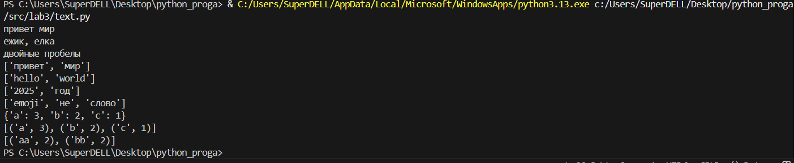
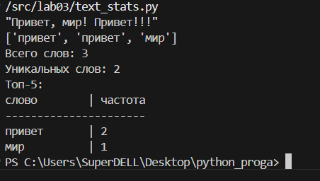
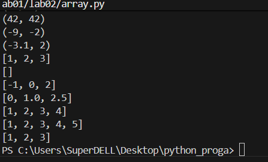
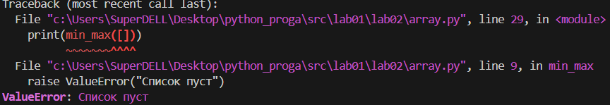
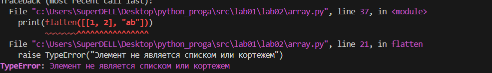
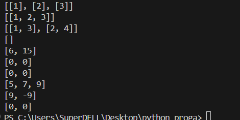
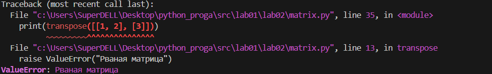
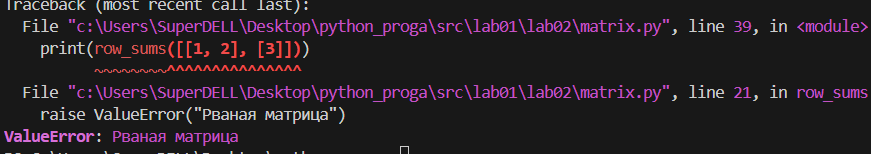
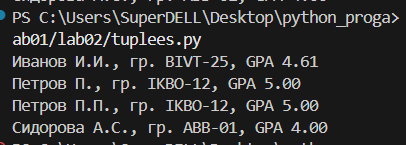

<h1>Программирование и алгоритмизация</h1>
<h2>Лабораторная работа №4</h2>

**Задание №1**

```
from pathlib import Path
import csv


def read_text(path: str | Path, encoding: str = "utf-8") -> str:
  
    path = Path(path)
    
    with open(path, 'r', encoding=encoding) as file:
        return file.read()


def write_csv(rows: list[tuple | list], path: str | Path, header: tuple[str, ...] | None = None) -> None:

    path = Path(path)
    
    # Создаем родительские директории если их нет
    ensure_parent_dir(path)
    
    # Проверяем одинаковую длину всех строк
    if rows:
        first_row_length = len(rows[0])
        for i, row in enumerate(rows):
            if len(row) != first_row_length:
                raise ValueError(f"Строка {i} имеет длину {len(row)}, ожидается {first_row_length}")
    
    with open(path, 'w', newline='', encoding='utf-8') as file:
        writer = csv.writer(file)
        
        if header is not None:
            writer.writerow(header)
        
        writer.writerows(rows)


def ensure_parent_dir(path: str | Path) -> None:
 
    path = Path(path)
    parent_dir = path.parent
    parent_dir.mkdir(parents=True, exist_ok=True)


if __name__ == "__main__":
    # Мини-тесты
    from io_txt_csv import read_text, write_csv
    
    # Тест записи CSV
    write_csv([("word", "count"), ("test", 3)], "data/check.csv")
    
    # Тест чтения текста (если файл существует)
    try:
        txt = read_text("test_input.txt")  # должен вернуть строку
        print("Файл успешно прочитан")
    except FileNotFoundError:
        print("Файл test_input.txt не найден")
    except UnicodeDecodeError:
        print("Ошибка кодировки при чтении файла")
```
**Задание №2**
```

import sys
import argparse
from pathlib import Path

# Добавляем путь к lib в sys.path для импорта модулей
lib_path = Path(__file__).parent.parent.parent / 'lib'
sys.path.insert(0, str(lib_path))

# Импортируем модули из предыдущих лабораторных
from io_txt_csv import read_text, write_csv
from lib.text import normalize, tokenize, count_freq, top_n


def generate_report(input_path: str, output_path: str, encoding: str = "utf-8") -> None:
    
    # Чтение входного файла
    try:
        text = read_text(input_path, encoding)
    except FileNotFoundError:
        print(f"Ошибка: файл '{input_path}' не найден")
        sys.exit(1)
    except UnicodeDecodeError as e:
        print(f"Ошибка кодировки: {e}")
        print("Попробуйте указать другую кодировку с помощью --encoding")
        sys.exit(1)
    
    # Нормализация и токенизация с использованием функций из lib/text.py
    normalized_text = normalize(text, casefold=True, yo2e=True)
    tokens = tokenize(normalized_text)
    
    # Подсчет частот
    frequencies = count_freq(tokens)
    
    # Сортировка: по убыванию частоты, при равенстве - по возрастанию слова
    sorted_words = sorted(frequencies.items(), 
                         key=lambda x: (-x[1], x[0]))
    
    # Запись CSV
    header = ("word", "count")
    write_csv(sorted_words, output_path, header)
    
    # Вывод резюме в консоль
    total_words = len(tokens)
    unique_words = len(frequencies)
    
    print(f"Всего слов: {total_words}")
    print(f"Уникальных слов: {unique_words}")
    
    if unique_words > 0:
        top_5_words = top_n(frequencies, 5)  # Используем функцию из lib/text.py
        print("Топ-5:")
        for i, (word, count) in enumerate(top_5_words, 1):
            print(f"  {i}. '{word}' - {count}")
    else:
        print("Топ-5: нет данных")
    
    print(f"Отчет сохранен в: {output_path}")


def main():
    """Основная функция скрипта."""
    parser = argparse.ArgumentParser(
        description="Генератор отчета по частотности слов в тексте"
    )
    parser.add_argument(
        "--in", 
        dest="input_file",
        default="test_input.txt",
        help="Входной текстовый файл (по умолчанию: test_input.txt)"
    )
    parser.add_argument(
        "--out",
        dest="output_file", 
        default="data/report.csv",
        help="Выходной CSV файл (по умолчанию: data/report.csv)"
    )
    parser.add_argument(
        "--encoding",
        default="utf-8",
        help="Кодировка входного файла (по умолчанию: utf-8)"
    )
    
    args = parser.parse_args()
    
    generate_report(args.input_file, args.output_file, args.encoding)


if __name__ == "__main__":
    main()
```

<h2>Лабораторная работа №3</h2>

**Задание №1**

```
import re

def normalize(text: str, *, casefold: bool = True, yo2e: bool = True) -> str:
    if casefold:
        text = text.casefold()
    if yo2e:
        text = text.replace('ё', 'е').replace('Ё', 'Е')
    text = re.sub(r'\s+', ' ', text).strip()
    return text


def tokenize(text: str) -> list[str]:
    return re.findall(r'\w+(?:-\w+)*', text)

def count_freq(tokens: list[str]) -> dict[str, int]:
    freq = {}
    for token in tokens:
        freq[token] = freq.get(token, 0) + 1 
    return freq


def top_n(freq: dict[str, int], n: int = 5) -> list[tuple[str, int]]:
    sorted_freq = sorted(freq.items(), key=lambda item: (-item[1], item[0]))
    return sorted_freq[:n]
print(normalize("ПрИвЕт\nМир\t"))
print(normalize("ёжик, Ёлка"))
print(normalize("  двойные   пробелы  "))
print(tokenize("привет мир"))
print(tokenize("hello,world!!!"))
print(tokenize("2025 год"))
print(tokenize("emoji 😀 не слово"))
print(count_freq(["a","b","a","c","b","a"]))
print(top_n(count_freq(["a","b","a","c","b","a"])))
print(top_n(count_freq(["bb","aa","bb","aa","cc"]), n=2))
```

**Задание №2**

```
import sys
from text import *

def text_info():
    text = sys.stdin.readline().strip()
    words = sorted(tokenize(normalize(text)), key=len, reverse=True)
    print(words)
    print(f"Всего слов: {len(tokenize(normalize(text)))}")
    print(f"Уникальных слов: {len(set(tokenize(normalize(text))))}")
    print("Топ-5:")
    print_word_frequency_table(text)
def print_word_frequency_table(text):
    freqs = count_freq(tokenize(normalize(text)))
    print('слово'.ljust(12), '|', 'частота')
    print('-' * 22)
    for word, count in sorted(freqs.items(), key=lambda x: x[1], reverse=True):
         print(word.ljust(12), '|', count)


text_info()
```



<h2>Лабораторная работа №2</h2>

**Задание №1**

```
#n=int(input('dlina:'))
#nums=[]
#i=0
#while i<n:
   # nums.append(input())
   # i+=1
def min_max(nums: list[float | int]) -> tuple[float | int, float | int]:
    if not nums:
        raise ValueError("Список пуст")
    return(min(nums), max(nums))


def unique_sorted(nums: list[float | int]) -> list[float | int]:
    return sorted(set(nums))


def flatten(mat: list[list | tuple]) -> list:
    result = []
    for row in mat:
        if not isinstance(row, (list, tuple)):
            raise TypeError("Элемент не является списком или кортежем")
        result.extend(row)
    return result
#print(min_max(nums))
print(min_max([3, -1, 5, 5, 0]))
print(min_max([42]))
print(min_max([-5, -2, -9]))
print(min_max([1.5, 2, 2.0, -3.1]))
#print(unique_sorted(nums))
print(unique_sorted([3, 1, 2, 1, 3]))
print(unique_sorted([]))
print(unique_sorted([-1, -1, 0, 2, 2]))
print(unique_sorted([1.0, 1, 2.5, 2.5, 0]))
print(flatten([[1, 2], [3, 4]]))
print(flatten(([1, 2], (3, 4, 5))))
print(flatten([[1], [], [2, 3]]))

#print(flatten([[1, 2], "ab"]))
#print(min_max([]))
```


При введении:

print(flatten([[1, 2], "ab"]))

print(min_max([]))

Вывод




**Задание №2**

```
def check_rectangular(mat):
    if not mat:
        return True
    length = len(mat[0])
    for row in mat:
        if len(row) != length:
            return False
    return True


def transpose(mat):
    if not check_rectangular(mat):
        raise ValueError("Рваная матрица")
    if not mat:
        return []
    return [list(row) for row in zip(*mat)]


def row_sums(mat):
    if not check_rectangular(mat):
        raise ValueError("Рваная матрица")
    return [sum(row) for row in mat]


def col_sums(mat):
    if not check_rectangular(mat):
        raise ValueError("Рваная матрица")
    if not mat:
        return []
    return [sum(col) for col in zip(*mat)]
print(transpose([[1, 2, 3]]))
print(transpose([[1], [2], [3]]))
print(transpose([[1, 2], [3, 4]]))
print(transpose([]))
#print(transpose([[1, 2], [3]]))

print(row_sums([[1, 2, 3], [4, 5, 6]]))
print(row_sums([[-1, 1], [10, -10]] ))
print(row_sums([[0, 0], [0, 0]]))
#print(row_sums([[1, 2], [3]]))

print(col_sums([[1, 2, 3], [4, 5, 6]]))
print(col_sums([[-1, 1], [10, -10]] ))
print(col_sums([[0, 0], [0, 0]]))
#print(col_sums([[1, 2], [3]]))
```



При введении:

print(transpose([[1, 2], [3]]))

print(row_sums([[1, 2], [3]]))

print(col_sums([[1, 2], [3]]))

Вывод:




**Задание №3**
```
from typing import Tuple

StudentRecord = Tuple[str, str, float]

def format_record(rec: StudentRecord) -> str:
    fio, group, gpa = rec
    fio_parts = [part.strip() for part in fio.split()]
    formatted_surname = fio_parts[0].capitalize()
    initials = ''.join([f'{name[0].upper()}.' for name in fio_parts[1:]])
    formatted_gpa = f'{gpa:.2f}'
    formatted_record = f"{formatted_surname} {initials}, гр. {group}, GPA {formatted_gpa}"
    return formatted_record

print(format_record(("Иванов Иван Иванович", "BIVT-25", 4.605)))
print(format_record(("Петров Пётр", "IKBO-12", 5.0)))
print(format_record(("Петров Пётр Петрович", "IKBO-12", 5.0)))
print(format_record(("  сидорова  анна   сергеевна ", "ABB-01", 3.999)))
#print(format_record(("  сидорова  анна   сергеевна ", 3.999)))
```


При введении:

print(format_record(("  сидорова  анна   сергеевна ", 3.999)))

Вывод:


<h2>Лабораторная работа №1</h2>

**Задание №1**

```
name=input("Имя: ")
age=int(input('Возрвст: '))
print(f'Привет {name}! Через год тебе будет {age+1}!')
```


**Задание №2**

```
a = input("a: ").replace(',', '.')
b = input("b: ").replace(',', '.')
a = float(a)
b = float(b)
_sum = a + b
_avg = _sum / 2
print(f"sum={_sum:.2f}; avg={_avg:.2f}")
```


**Задание №3**
```
price=float(input())
discount=float(input())
vat=float(input())
base=price*(1-discount/100)
vat_amount=base*(vat/100)
total=base+vat_amount
print(f'База после скидки:{base:.2f}₽')
print(f'НДС:{vat_amount:.2f}₽')
print(f'Итого к оплате:{total:.2f}₽')
```


**Задание №4**
```
m=int(input('минуты:'))
hours=m//60
minutes=m%60
print(f'{hours}:{minutes:02d}')
```


**Задание №5**
```
a, b, c = input().split()
print(f"ФИО: {a} {b} {c}")
print(f"Инициалы: {a[0]}{b[0]}{c[0]}.")
print(f"Длина (символов): {len(a) + len(b) + len(c) + 2}")
```


**Задание №6**
```
N=int(input('in_1:'))
onsite=0
remote=0
for _ in range(N):
    count="in_"+str(_+2)+':'
    line=input(count).strip().split()
    surname,name,age,format_part=line
    if format_part=="True":
        onsite+=1
    else:
        remote+=1
print('out:',onsite, remote)
```


**Задание №7**
```
encoded= input('in:')
first_char_pos = 0
for i, char in enumerate(encoded):
    if 'A' <= char <= 'Z':
        first_char_pos = i
        first_char = char
        break
digit_position = 0
for i, char in enumerate(encoded):
    if char.isdigit():
        digit_position = i
        break
second_char = encoded[digit_position + 1]
step = digit_position + 1 - first_char_pos
result = first_char + second_char 
current_position = digit_position + 1 + step
while current_position < len(encoded) and encoded[current_position] != '.':
    result += encoded[current_position]
    current_position += step
result += "." 
print('out:',result)

```
