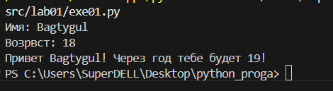
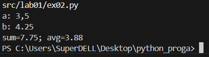
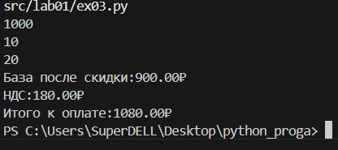
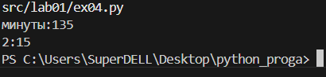
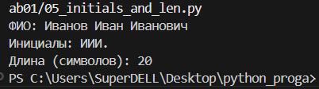
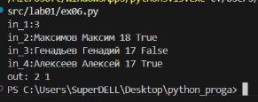
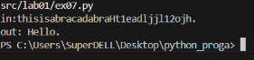

<h1>Программирование и алгоритмизация</h1>
<h2>Лабораторная работа №1</h2>

**Задание №1**

```
name=input("Имя: ")
age=int(input('Возрвст: '))
print(f'Привет {name}! Через год тебе будет {age+1}!')
```

**Задание №2**

```
a = input("a: ").replace(',', '.')
b = input("b: ").replace(',', '.')
a = float(a)
b = float(b)
_sum = a + b
_avg = _sum / 2
print(f"sum={_sum:.2f}; avg={_avg:.2f}")
```

**Задание №3**
```
price=float(input())
discount=float(input())
vat=float(input())
base=price*(1-discount/100)
vat_amount=base*(vat/100)
total=base+vat_amount
print(f'База после скидки:{base:.2f}₽')
print(f'НДС:{vat_amount:.2f}₽')
print(f'Итого к оплате:{total:.2f}₽')
```

**Задание №4**
```
m=int(input('минуты:'))
hours=m//60
minutes=m%60
print(f'{hours}:{minutes:02d}')
```

**Задание №5**
```
fio=input()
_fio=fio.strip()
parts=_fio.split()
initials="".join(p[0].upper() for p in parts if p)
length=len(_fio)
print(f'ФИО:{_fio}')
print(f'Инитициалы:{initials}')
print(f'Длина(символов):{length}')
```

**Задание №6**
```
N=int(input('in_1:'))
onsite=0
remote=0
for _ in range(N):
    count="in_"+str(_+2)+':'
    line=input(count).strip().split()
    surname,name,age,format_part=line
    if format_part=="True":
        onsite+=1
    else:
        remote+=1
print('out:',onsite, remote)
```

**Задание №7**
```
encoded= input('in:')
first_char_pos = 0
for i, char in enumerate(encoded):
    if 'A' <= char <= 'Z':
        first_char_pos = i
        first_char = char
        break
digit_position = 0
for i, char in enumerate(encoded):
    if char.isdigit():
        digit_position = i
        break
second_char = encoded[digit_position + 1]
step = digit_position + 1 - first_char_pos
result = first_char + second_char 
current_position = digit_position + 1 + step
while current_position < len(encoded) and encoded[current_position] != '.':
    result += encoded[current_position]
    current_position += step
result += "." 
print('out:',result)

```
