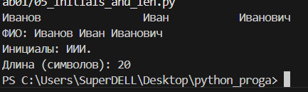

<h1>Программирование и алгоритмизация</h1>
<h2>Лабораторная работа №2</h2>

**Задание №1**

```
#n=int(input('dlina:'))
#nums=[]
#i=0
#while i<n:
   # nums.append(input())
   # i+=1
def min_max(nums: list[float | int]) -> tuple[float | int, float | int]:
    if not nums:
        raise ValueError("Список пуст")
    return(min(nums), max(nums))


def unique_sorted(nums: list[float | int]) -> list[float | int]:
    return sorted(set(nums))


def flatten(mat: list[list | tuple]) -> list:
    result = []
    for row in mat:
        if not isinstance(row, (list, tuple)):
            raise TypeError("Элемент не является списком или кортежем")
        result.extend(row)
    return result
#print(min_max(nums))
print(min_max([3, -1, 5, 5, 0]))
print(min_max([42]))
print(min_max([-5, -2, -9]))
print(min_max([1.5, 2, 2.0, -3.1]))
#print(unique_sorted(nums))
print(unique_sorted([3, 1, 2, 1, 3]))
print(unique_sorted([]))
print(unique_sorted([-1, -1, 0, 2, 2]))
print(unique_sorted([1.0, 1, 2.5, 2.5, 0]))
print(flatten([[1, 2], [3, 4]]))
print(flatten(([1, 2], (3, 4, 5))))
print(flatten([[1], [], [2, 3]]))

#print(flatten([[1, 2], "ab"]))
#print(min_max([]))
```


При введении:
print(flatten([[1, 2], "ab"]))
print(min_max([]))


**Задание №2**

```
def check_rectangular(mat):
    if not mat:
        return True
    length = len(mat[0])
    for row in mat:
        if len(row) != length:
            return False
    return True


def transpose(mat):
    if not check_rectangular(mat):
        raise ValueError("Рваная матрица")
    if not mat:
        return []
    return [list(row) for row in zip(*mat)]


def row_sums(mat):
    if not check_rectangular(mat):
        raise ValueError("Рваная матрица")
    return [sum(row) for row in mat]


def col_sums(mat):
    if not check_rectangular(mat):
        raise ValueError("Рваная матрица")
    if not mat:
        return []
    return [sum(col) for col in zip(*mat)]
print(transpose([[1, 2, 3]]))
print(transpose([[1], [2], [3]]))
print(transpose([[1, 2], [3, 4]]))
print(transpose([]))
#print(transpose([[1, 2], [3]]))

print(row_sums([[1, 2, 3], [4, 5, 6]]))
print(row_sums([[-1, 1], [10, -10]] ))
print(row_sums([[0, 0], [0, 0]]))
#print(row_sums([[1, 2], [3]]))

print(col_sums([[1, 2, 3], [4, 5, 6]]))
print(col_sums([[-1, 1], [10, -10]] ))
print(col_sums([[0, 0], [0, 0]]))
#print(col_sums([[1, 2], [3]]))
```


При введении:
print(transpose([[1, 2], [3]]))
print(row_sums([[1, 2], [3]]))
print(col_sums([[1, 2], [3]]))

Вывод:


**Задание №3**
```
from typing import Tuple

StudentRecord = Tuple[str, str, float]

def format_record(rec: StudentRecord) -> str:
    fio, group, gpa = rec
    fio_parts = [part.strip() for part in fio.split()]
    formatted_surname = fio_parts[0].capitalize()
    initials = ''.join([f'{name[0].upper()}.' for name in fio_parts[1:]])
    formatted_gpa = f'{gpa:.2f}'
    formatted_record = f"{formatted_surname} {initials}, гр. {group}, GPA {formatted_gpa}"
    return formatted_record

print(format_record(("Иванов Иван Иванович", "BIVT-25", 4.605)))
print(format_record(("Петров Пётр", "IKBO-12", 5.0)))
print(format_record(("Петров Пётр Петрович", "IKBO-12", 5.0)))
print(format_record(("  сидорова  анна   сергеевна ", "ABB-01", 3.999)))
#print(format_record(("  сидорова  анна   сергеевна ", 3.999)))
```


При введении:
print(format_record(("  сидорова  анна   сергеевна ", 3.999)))
Вывод:


<h1>Программирование и алгоритмизация</h1>
<h2>Лабораторная работа №1</h2>

**Задание №1**

```
name=input("Имя: ")
age=int(input('Возрвст: '))
print(f'Привет {name}! Через год тебе будет {age+1}!')
```


**Задание №2**

```
a = input("a: ").replace(',', '.')
b = input("b: ").replace(',', '.')
a = float(a)
b = float(b)
_sum = a + b
_avg = _sum / 2
print(f"sum={_sum:.2f}; avg={_avg:.2f}")
```


**Задание №3**
```
price=float(input())
discount=float(input())
vat=float(input())
base=price*(1-discount/100)
vat_amount=base*(vat/100)
total=base+vat_amount
print(f'База после скидки:{base:.2f}₽')
print(f'НДС:{vat_amount:.2f}₽')
print(f'Итого к оплате:{total:.2f}₽')
```


**Задание №4**
```
m=int(input('минуты:'))
hours=m//60
minutes=m%60
print(f'{hours}:{minutes:02d}')
```


**Задание №5**
```
a, b, c = input().split()
print(f"ФИО: {a} {b} {c}")
print(f"Инициалы: {a[0]}{b[0]}{c[0]}.")
print(f"Длина (символов): {len(a) + len(b) + len(c) + 2}")
```


**Задание №6**
```
N=int(input('in_1:'))
onsite=0
remote=0
for _ in range(N):
    count="in_"+str(_+2)+':'
    line=input(count).strip().split()
    surname,name,age,format_part=line
    if format_part=="True":
        onsite+=1
    else:
        remote+=1
print('out:',onsite, remote)
```


**Задание №7**
```
encoded= input('in:')
first_char_pos = 0
for i, char in enumerate(encoded):
    if 'A' <= char <= 'Z':
        first_char_pos = i
        first_char = char
        break
digit_position = 0
for i, char in enumerate(encoded):
    if char.isdigit():
        digit_position = i
        break
second_char = encoded[digit_position + 1]
step = digit_position + 1 - first_char_pos
result = first_char + second_char 
current_position = digit_position + 1 + step
while current_position < len(encoded) and encoded[current_position] != '.':
    result += encoded[current_position]
    current_position += step
result += "." 
print('out:',result)

```
