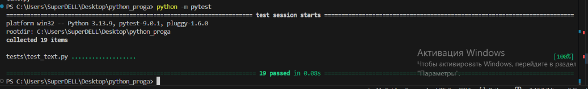
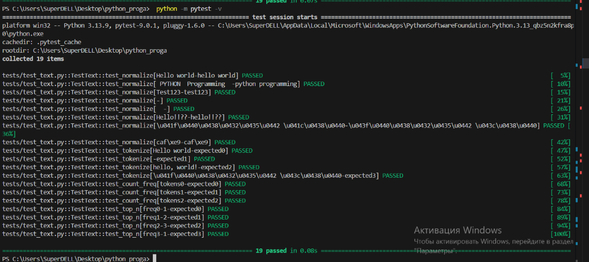
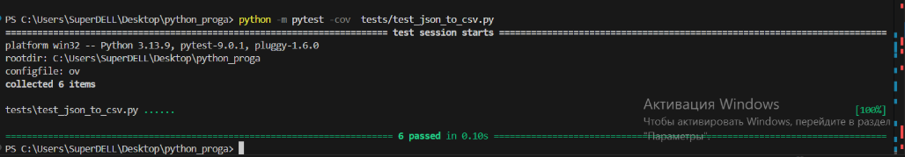
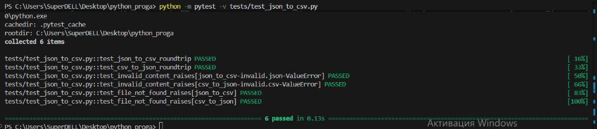

<h1>Программирование и алгоритмизация</h1>
<h2>Лабораторная работа №7</h2>

**Задание 1**

``` python
import pytest
#import sys
#import os


#sys.path.insert(0, os.path.dirname(os.path.dirname(os.path.abspath(__file__))))

#from lib.text import normalize, tokenize, count_freq, top_n
from src.lab03.text import normalize, tokenize, count_freq, top_n


class TestText:

    @pytest.mark.parametrize(
        "input_text, expected",
        [
            ("Hello world", "hello world"),
            (" PYTHON  Programming  ", "python programming"),
            ("Test123", "test123"),
            ("", ""),
            ("  ", ""),
            ("Hello!!??", "hello!!??"),
            ("Привет Мир", "привет мир"),
            ("café", "café"),
        ],
    )
    def test_normalize(self, input_text, expected):
        assert normalize(input_text) == expected

    @pytest.mark.parametrize(
        "input_text, expected",
        [
            ("Hello world", ["Hello", "world"]),
            ("", []),
            ("hello, world!", ["hello", "world"]),
            ("Привет мир", ["Привет", "мир"]),
        ],
    )
    def test_tokenize(self, input_text, expected):
        assert tokenize(input_text) == expected

    @pytest.mark.parametrize(
        "tokens, expected",
        [
            (["hello", "world", "hello"], {"hello": 2, "world": 1}),
            ([], {}),
            (["a", "b", "a", "c", "c"], {"a": 2, "b": 1, "c": 2}),
        ],
    )
    def test_count_freq(self, tokens, expected):
        assert count_freq(tokens) == expected

    @pytest.mark.parametrize(
        "freq, n, expected",
        [
            ({"hello": 2, "world": 1}, 1, [("hello", 2)]),
            ({"a": 2, "b": 2, "c": 1}, 2, [("a", 2), ("b", 2)]),
            ({"x": 3, "y": 3, "z": 3}, 3, [("x", 3), ("y", 3), ("z", 3)]),
            ({}, 1, []),
        ],
    )
    def test_top_n(self, freq, n, expected):
        assert top_n(freq, n) == expected
```





**Задание 2**

```python
import json
import csv
#import sys
#import os
from pathlib import Path
import pytest


#sys.path.insert(0, os.path.dirname(os.path.dirname(os.path.abspath(__file__))))


#from lib.json_csv import json_to_csv, csv_to_json

from src.lab05.json_csv import json_to_csv, csv_to_json

def test_json_to_csv_roundtrip(tmp_path: Path):
    src = tmp_path / "people.json"
    dst = tmp_path / "people.csv"
    data = [
        {"name": "Alice", "age": 22},
        {"name": "Bob", "age": 25},
    ]
    src.write_text(json.dumps(data, ensure_ascii=False, indent=2), encoding="utf-8")
    json_to_csv(str(src), str(dst))

    with dst.open(encoding="utf-8") as f:
        rows = list(csv.DictReader(f))

    assert len(rows) == len(data)
    assert {"name", "age"} <= set(rows[0].keys())


def test_csv_to_json_roundtrip(tmp_path: Path):
    src = tmp_path / "people.csv"
    dst = tmp_path / "people_out.json"
    rows = [
        {"name": "Alice", "age": "22"},
        {"name": "Bob", "age": "25"},
    ]
    with src.open("w", encoding="utf-8", newline="") as f:
        writer = csv.DictWriter(f, fieldnames=["name", "age"])
        writer.writeheader()
        writer.writerows(rows)

    csv_to_json(str(src), str(dst))

    data_out = json.loads(dst.read_text(encoding="utf-8"))

    assert len(data_out) == len(rows)
    assert all("name" in rec and "age" in rec for rec in data_out)


@pytest.mark.parametrize(
    "func, input_file, error",
    [
        ("json_to_csv", "invalid.json", ValueError),
        ("csv_to_json", "invalid.csv", ValueError),
    ],
)
def test_invalid_content_raises(func, input_file, error, tmp_path: Path):
    # Создаем файл с некорректным содержимым
    fpath = tmp_path / input_file
    fpath.write_text("this is not valid json or csv", encoding="utf-8")

    # Подготавливаем путь назначения
    dst = tmp_path / "out.file"

    # Выбираем функцию для теста
    f = json_to_csv if func == "json_to_csv" else csv_to_json

    with pytest.raises(error):
        f(str(fpath), str(dst))


@pytest.mark.parametrize("func", [json_to_csv, csv_to_json])
def test_file_not_found_raises(func, tmp_path: Path):
    non_existent_path = tmp_path / "no_such_file.non"
    dst = tmp_path / "out.file"
    with pytest.raises(FileNotFoundError):
        func(str(non_existent_path), str(dst))

```



