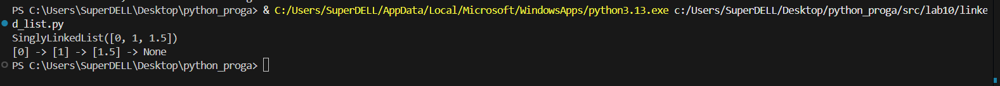

<h2>Лабораторная работа №10</h2>


**Задание**

```python
from collections import deque
from typing import Any


class Stack:
    """Стек (LIFO) на основе списка."""

    def __init__(self) -> None:
        self._data: list[Any] = []

    def push(self, item: Any) -> None:
        """Добавить элемент на вершину стека."""
        self._data.append(item)

    def pop(self) -> Any:
        """Снять и вернуть верхний элемент стека.
        Выбрасывает IndexError, если стек пуст.
        """
        if self.is_empty():
            raise IndexError("pop from empty stack")
        return self._data.pop()

    def peek(self) -> Any | None:
        """Вернуть верхний элемент без удаления.
        Возвращает None, если стек пуст.
        """
        return self._data[-1] if self._data else None

    def is_empty(self) -> bool:
        """Проверить, пуст ли стек."""
        return len(self._data) == 0

    def __len__(self) -> int:
        return len(self._data)

    def __repr__(self) -> str:
        return f"Stack({self._data})"


class Queue:
    """Очередь (FIFO) на основе collections.deque."""

    def __init__(self) -> None:
        self._data: deque[Any] = deque()

    def enqueue(self, item: Any) -> None:
        """Добавить элемент в конец очереди."""
        self._data.append(item)

    def dequeue(self) -> Any:
        """Извлечь и вернуть первый элемент очереди.
        Выбрасывает IndexError, если очередь пуста.
        """
        if self.is_empty():
            raise IndexError("dequeue from empty queue")
        return self._data.popleft()

    def peek(self) -> Any | None:
        """Вернуть первый элемент без удаления.
        Возвращает None, если очередь пуста.
        """
        return self._data[0] if self._data else None

    def is_empty(self) -> bool:
        """Проверить, пуста ли очередь."""
        return len(self._data) == 0

    def __len__(self) -> int:
        return len(self._data)

    def __repr__(self) -> str:
        return f"Queue({list(self._data)})"

 ```


 **Задание2**
 
 ```python
 from typing import Any, Optional, Iterator


class Node:
    """Узел односвязного списка."""

    def __init__(self, value: Any, next_node: Optional["Node"] = None) -> None:
        self.value = value
        self.next = next_node

    def __repr__(self) -> str:
        return f"[{self.value}]"


class SinglyLinkedList:
    """Односвязный список."""

    def __init__(self) -> None:
        self.head: Optional[Node] = None
        self.tail: Optional[Node] = None
        self._size: int = 0

    def append(self, value: Any) -> None:
        """Добавить элемент в конец списка за O(1)."""
        new_node = Node(value)
        if self.tail is None:
            self.head = self.tail = new_node
        else:
            self.tail.next = new_node
            self.tail = new_node
        self._size += 1

    def prepend(self, value: Any) -> None:
        """Добавить элемент в начало списка за O(1)."""
        new_node = Node(value, self.head)
        self.head = new_node
        if self.tail is None:
            self.tail = new_node
        self._size += 1

    def insert(self, idx: int, value: Any) -> None:
        """Вставить элемент по индексу idx.
        Допустимые индексы: от 0 до len(self) включительно.
        """
        if idx < 0 or idx > len(self):
            raise IndexError("list index out of range")
        if idx == 0:
            self.prepend(value)
            return
        if idx == len(self):
            self.append(value)
            return
        current = self.head
        for _ in range(idx - 1):
            assert current is not None
            current = current.next
        new_node = Node(value, current.next)
        current.next = new_node
        self._size += 1

    def remove_at(self, idx: int) -> None:
        """Удалить элемент по индексу."""
        if idx < 0 or idx >= len(self):
            raise IndexError("list index out of range")
        if idx == 0:
            assert self.head is not None
            self.head = self.head.next
            if self.head is None:
                self.tail = None
            self._size -= 1
            return
        current = self.head
        for _ in range(idx - 1):
            assert current is not None
            current = current.next
        assert current is not None and current.next is not None
        current.next = current.next.next
        if current.next is None:
            self.tail = current
        self._size -= 1

    def __iter__(self) -> Iterator[Any]:
        """Итерация по значениям списка (от головы к хвосту)."""
        current = self.head
        while current:
            yield current.value
            current = current.next

    def __len__(self) -> int:
        return self._size

    def __repr__(self) -> str:
        return f"SinglyLinkedList({list(self)})"

    def display(self) -> str:
        """Красивый вывод: [A] -> [B] -> [C] -> None"""
        if self.head is None:
            return "None"
        parts = []
        current = self.head
        while current:
            parts.append(f"[{current.value}]")
            current = current.next
        return " -> ".join(parts) + " -> None"


if __name__ == "__main__":
    # Пример использования
    lst = SinglyLinkedList()
    lst.append(1)
    lst.append(2)
    lst.prepend(0)
    lst.insert(2, 1.5)
    lst.remove_at(3)
    print(lst)  # SinglyLinkedList([0, 1, 2])
    print(lst.display())  # [0] -> [1] -> [2] -> None
```

